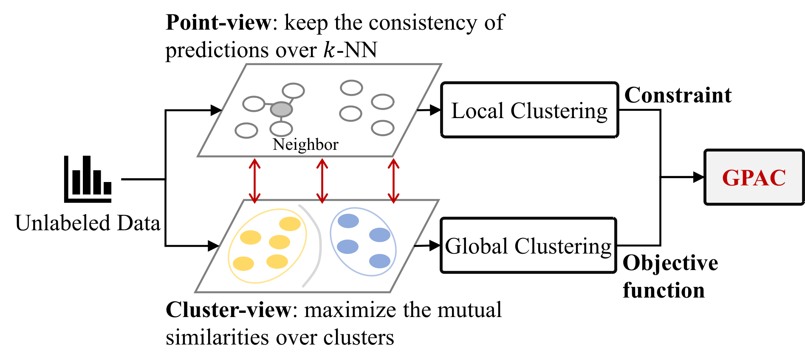

# Graph-Probability-Aggregation-Clustering
## Overview
This is the code for the paper "Graph Probability Aggregation Clustering". \
GPAC introduces an objective function for cluster-wise clustering and incorporates a consistency constraint for point-wise clustering.\

## Dependency
python--3.7.16\
scipy--1.6.2\
scikit-learn--1.0.2\
tqdm--4.64.1\
numpy--1.19.2\
faiss-cpu--1.7.2
